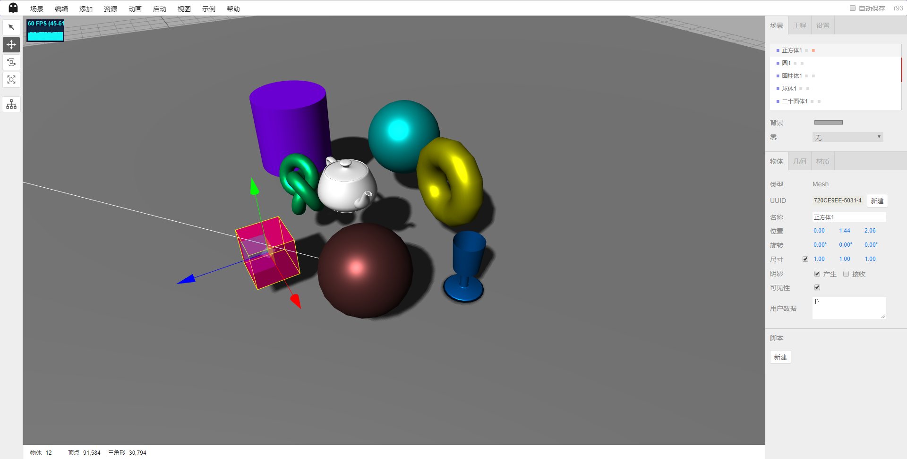
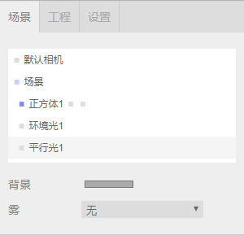
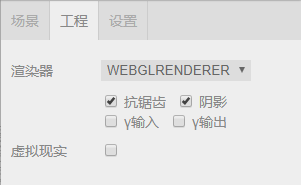

# Shadow Editor

* 名称：Shadow Editor
* 版本：v0.0.3
* 说明：Three.js自带编辑器的二次开发。
* 示例：https://tengge1.github.io/ShadowEditor/demo/index.html
* 文档：https://tengge1.github.io/ShadowEditor/docs/release/index.html

## 主要功能

1. 3D场景在线编辑。
2. 11种基本几何体、5种光源，支持雾效、阴影。
2. 各种类型3D模型的导入导出。例如：`amf`、`awd`、`babylon`、`babylonmeshdata`、`ctm`、`dae`、
`fbx`、`glb`、`gltf`、`js`、`json`、`3geo`、`3mat`、`3obj`、`3scn`、`kmz`、`md2`、
`obj`、`playcanvas`、`ply`、`stl`、`vtk`、`wrl`。
3. 场景树状显示。
3. 物体、几何体、材质编辑。
4. js脚本编辑智能提示。

## 使用方法

**该项目仅支持Windows系统，电脑上需要安装.Net Framework 4.5。**

1. 安装`NodeJs`，转到`ShadowEditor.Web`目录，运行以下命令。

```bash
npm install
npm run build
```

2. 下载`MongoDB`，安装并启动MongoDB服务

3. 编辑文件`ShadowEditor.Web/Web.config`，将`27017`修改为你电脑上MongoDB服务的端口。

```xml
<add key="mongo_connection" value="mongodb://127.0.0.1:27017" />
```

4. 使用`Visual Studio 2017`打开项目，生成`ShadowEditor.Web`项目。

5. 将`ShadowEditor.Web`部署在iis上即可在浏览器中访问。

## 项目截图

**基本界面**



**菜单栏**


**工具箱**


**场景层次图**



**物体编辑**


**几何体编辑**


**材质编辑**


**渲染器设置**



**主题和历史面板**


**脚本编辑**


## 开发日志

**v0.0.2**

* 发布时间：2018年6月9日
* 更新日志：使用rollup重构three.js自带编辑器的代码。

**v0.0.1**

* 发布时间：2017年6月21日  
* 更新日志：主要完成three.js自带编辑器的翻译。


## 相关链接

* Three.js官网：https://threejs.org/
* Three.js源码：https://github.com/mrdoob/three.js/
